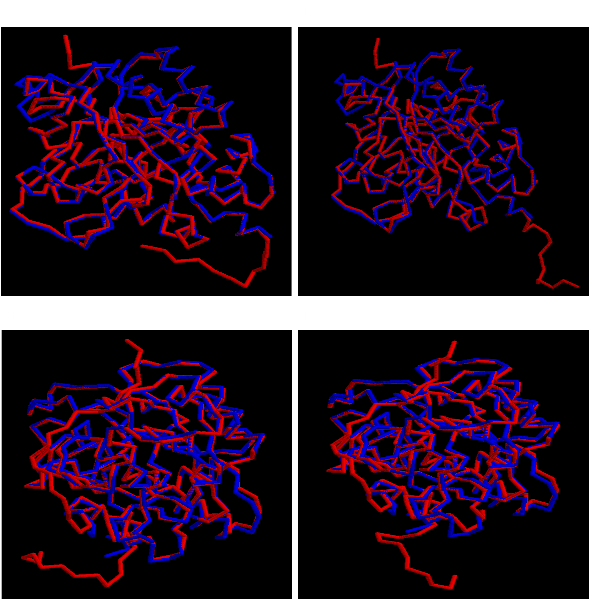

# Comparative Modelling 

## Pendientes:
* Escribir reporte
* 
* Evaluación del modelo
*   Correr Procheck
*   Correr (en web) PROSA y Qmeans
*   Sacar imágenes
*   Correr PSIPRED y DSSP

## Introducción

## Métodos
Para este trabajo utilizamos las secuencias en formato fasta de (nuestra proteína de interés)[] así como las de los (templates seleccionados del PDB)[]. Estos 5 templates fueron los *hits* con el *score* más alto después de hacer *BLAST* contra una copia local de la base de datos del pdb disponible en los servidores de la Licenciatura en Ciencias Genómicas. Para hacer el modelado comparativo seguimos dos aproximaciones: una basada en alineamiento de secuencias de aminoácidos y otro basado en alineamientos estructurales. Para hacer el alineamiento por secuencia utilizamos **clustalw**. Por otro lado, para hacer el alineamiento estructural, partimos de los PDBs de los templates y los alineamos utilizando **STAMP**. Posteriormente, utilizamos este alineamiento para construir un modelo oculto de Markov utilizando los programas **hmmbuild** y **hmmcalibrate** de la *suite* hmmer-2.2g. Utilizando el programa **hmmalign**, alineamos la secuencia de (nuestra proteína de interés) con las de los templates. Una vez con ambos alineamientos (por secuencia y por estructura), hicimos el modelado comparativo utilizando el programa de **mod9.21**. 

## Resultados
Para tener una referencia visual de nuestros modelos obtenidos, alineamos estructuralemnte cada uno de los modelos con alguno de los *templates*. Para seleccionar esos *templates*, se corrió STAMP para calcular el RMS de cada modelo contra las referencias. Posteriormente, para cada modelo se seleccionó el *template* con el que tuviera un menor RMS. Curiosamente, los modelos obtenidos por medio de alineamientos por secuencia resultaron ser más parecidos al *template* 7xr8, mientras que los modelos obtenidos por alineamiento estructual se parecieron más al molde 7y6m. A continuación se presentan algunas imágenes obtenidas con rasmol.

**Figura 1. Alineamiento estructural de los modelos contra los *templates*.** **A** Comparación del modelo1 (cadena roja) obtenido por secuencia contra el *template* 7xr8 (cadena azul). **B** Comparación del modelo2 (cadena roja) obtenido por secuencia contra el *template* 7xr8 (cadena azul). **C** Comparación del modelo1 (cadena roja) obtenido por alineamiento estructural contra el *template* 7y6m (cadena azul). **D** Comparación del modelo2 (cadena roja) obtenido por alineamiento estructural contra el *template* 7y6m (cadena azul). Las imágenes fueron obtenidas con rasmol, con el parámetro *display* en *backbone* y el *color* en *chain*.

Con esta inspección visual podemos ver que todos los modelos tienen problemas en el extremo N terminal, ya que esta sección de la proteína aparece extendida de forma muy variable. En general, la estructura globular de cada uno de los modelos se ajusta bien con el *template* usado como referencia, dando la impresión de una buena resolución en general. Sin embargo, para poder caracterizar de manera objetiva la calidad de los modelos obtenidos, tenemos que aplicar otras metodologías para evaluar las propiedades estereoquímicas de las estructuras.

## Discusión

## Conclusión

